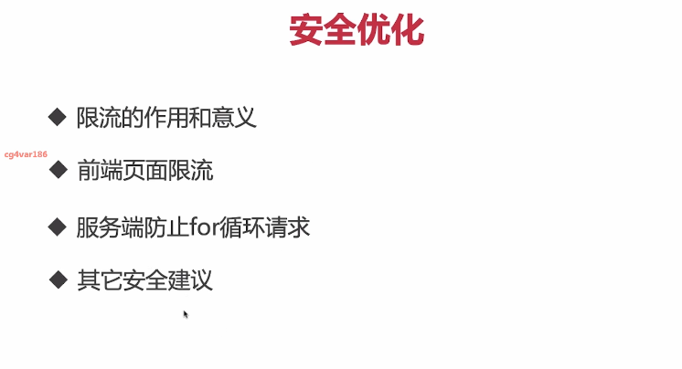

**章节目录：**

**第1章 课程介绍【学前须知】**
**本章对这门课程进行说明，包括：秒杀系统涉及模块的介绍，秒杀核心的知识点的介绍，课程的学习规划等。**

**1-1 课程介绍 试看**
**1-2 \**\*学前必读\**\*（助你平稳踩坑，畅学无忧，课程学习与解决问题指南）**
**第2章 秒杀系统需求整理&系统设计 【明确需求】**
**本章对秒杀系统整体需求进行梳理，明确系统具体需求，讲解系统原型设计工具的使用，并结合秒杀系统进行整体架构设计。**

**2-1 需求分析**
**2-2 系统架构设计**
**2-3 【总结&扩展】需求整理&系统设计**
**2-4 【勤于思考，夯实学习成果】阶段练习题**
**第3章 环境搭建之初识RabbitMQ 【性能优化核心组件初探】**
**本章介绍如何搭建RabbitMQ 环境，并且介绍RabbitMQ核心概念，以及RabbitMQ在日常工作中常用的5种模式，并且讲解不同模式下存在的差异和适用场景。**

**3-1 RabitMq 环境安装**
**3-2 RabbitMQ常用命令及管理界面**
**3-3 RabbitMQ核心概念**
**3-4 RabbitMQ工作模式---Simple模式（上）**
**3-5 RabbitMQ工作模式---Simple模式（中）**
**3-6 RabbitMQ工作模式---Simple模式（下）**
**3-7 RabbitMQ工作模式---Work模式**
**3-8 RabbitMQ工作模式---Publish模式 试看**
**3-9 RabbitMQ工作模式---Routing模式**
**3-10 RabbitMQ工作模式---Topic模式**
**3-11 【扩展资料】CentOS7 之基础设置及常见操作命令**
**3-12 【阶段总结】环境搭建之初识RabbitMQ**
**3-13 【勤于思考，夯实学习成果】阶段练习题**
**第4章 环境搭建之Iris 框架入门 【系统核心架构初探】**
**本章重点介绍了GO语言web框架iris的入门知识，主要包括：介绍iris中mvc基础概念，mvc 工作流程，代码目录结构等。**

**4-1 Iris框架入门---MVC是什么**
**4-2 Iris框架入门---MVC目录结构及main.go介绍**
**4-3 Iris框架入门---快速入门案例**
**4-4 【扩展资料】Iris框架核心源码解读和分析**
**4-5 【阶段总结】环境搭建之Iris 框架入门**
**4-6 【勤于思考，夯实学习成果】阶段练习题**
**第5章 后台管理功能开发之商品管理功能开发【核心业务功能开发】**
**本章将应用Iris框架，完成后台商品管理功能的开发，带领同学们在了解GO语言web开发的流程和顺序的基础上，进一步结合业务需求，完成系统核心业务功能开发。**

**5-1 项目结构搭建&main.go编写**
**5-2 商品模型开发**
**5-3 商品repository开发---数据连接**
**5-4 【扩展资料】Struct中接口类型**
**5-5 商品repository开发---插入**
**5-6 商品repository开发---删除&更新**
**5-7 商品repository开发---查询单条记录**
**5-8 商品repository开发---查询所有记录**
**5-9 商品管理功能 service 实现 试看**
**5-10 商品管理功能Controller&View开发 （上）**
**5-11 【扩展资料】form.go 用法说明**
**5-12 商品管理功能Controller&View开发 （中）**
**5-13 商品管理功能controller&View开发（下）**
**5-14 【扩展资料】Golang 模板(template)的基本语法**
**5-15 【扩展资料】什么是中间件？**
**5-16 【阶段总结】后台管理功能开发之商品管理功能开发**
**5-17 【勤于思考，夯实学习成果】阶段练习题**
**第6章 后台管理功能开发之订单功能开发【核心业务功能开发】**
**本章将带领小伙伴们继续开发，基于Iris框架应用完成后台管理功能的订单管理模块。**

**6-1 订单管理功能开发---model开发**
**6-2 订单管理功能开发---repository开发（上）**
**6-3 订单管理功能开发---repository开发（中）**
**6-4 订单管理功能开发---repository开发（下）**
**6-5 订单管理功能开发---service开发**
**6-6 订单管理功能开发---Controller&View开发**
**6-7 【扩展资料】Go语言中的Tag语法**
**6-8 【阶段总结】后台管理功能开发之订单功能开发**
**6-9 【勤于思考，夯实学习成果】阶段练习题**
**第7章 秒杀前台功能开发 之用户注册登录功能开发【核心业务功能开发】**
**本章主要介绍如何应用Iris框架，继续完善秒杀系统基础功能。主要内容包括：用户登陆和注册功能，并且讲解用户模型建设，数据操作以及控制器编写。**

**7-1 用户登录页面开发---model开发**
**7-2 用户登录页面开发---repository开发（上）**
**7-3 用户登录页面开发---repository开发（下）**
**7-4 用户登录页面开发---service开发**
**7-5 用户登录页面展示---Controler&View开发（上）**
**7-6 用户登录页面展示---Controller&View开发（中）**
**7-7 用户登录页面展示---Controller&View开发（下）**
**7-8 【扩展资料】验证码的原理及作用**
**7-9 【阶段总结】秒杀前台功能开发**
**7-10 【勤于思考，夯实学习成果】阶段练习题**
**第8章 秒杀前台功能开发之商品展示及数据控制功能开发【核心业务功能开发】**
**本章介绍如何在原有框架的基础上进一步完成商品信息查询，商品控制器开发、商品展示页面制作以及结合商品数量控制功能，完成抢购后扣除商品和添加新订单信息的代码实现。**

**8-1 商品详情展示页面（上）**
**8-2 商品详情展示页面（下）**
**8-3 商品详情展示页面---访问权限设置**
**8-4 【扩展阅读】Go Iris 中间件**
**8-5 商品数据控制（上）**
**8-6 商品数据控制（下）**
**8-7 【扩展资料】商品模型设计思路拓展**
**8-8 【阶段总结】商品详情页及数量控制开发**
**8-9 【勤于思考，夯实学习成果】阶段练习题**
**第9章 秒杀系统分析&前端优化【核心优化方案落地】**
**本章在秒杀功能的基础上总结现有架构，带领大家梳理整个系统的压力点，并且根据秒杀系统的特点优化最终架构。之后讲解如何使用GO语言实现页面静态化功能，介绍 CDN的原理和使用，并且演示如何把静态页面发布到CDN中，提升页面展示能力。...**

**9-1 基础架构分析**
**9-2 秒杀分布式架构设计**
**9-3 为什么要进行页面静态化**
**9-4 静态化代码实现（上）**
**9-5 静态化代码实现（中）**
**9-6 静态化代码实现（下）**
**9-7 【扩展阅读】GO语言中os包的学习与使用(文件，目录，进程的操作)**
**9-8 【扩展资料】Go基础之文件操作**
**9-9 CDN原理和作用**
**9-10 阿里云添加CDN**
**9-11 部署前端的静态文件**
**9-12 【扩展资料】前端性能优化之页面优化**
**9-13 【扩展资料】前端优化之代码优化**
**9-14 【阶段总结】系统分析&前端优化**
**9-15 【勤于思考，夯实阶段成果】阶段练习题**
**第10章 服务端性能优化之实现cookie验证 【核心优化方案落地】**
**针对后端优化，本章首先介绍后端优化思路，讲解Session原理，并且讲解登陆验证实现原理。并在此基础上改造代码完成基于cookie的验证，最后演示验证登陆代码的改造效果。**

**10-1 后端接口优化思路**
**10-2 cookie替换session**
**10-3 登陆代码改造（1）**
**10-4 登陆代码改造（2）**
**10-5 登陆代码改造（3）**
**10-6 登陆代码改造（4）**
**10-7 【扩展资料】AES详细介绍**
**10-8 【扩展资料】分组对称加密模式**
**10-9 【阶段总结】服务端优化cookie验证基础实现**
**10-10 【勤于思考，夯实阶段成果】阶段练习题**
**第11章 服务端性能优化之分布式验证实现【核心优化方案落地】**
**本章首先介绍分布式原理，调整验证架构，在调整好的架构上实现cookie权限验证，之后讲解什么是一致性hash算法，并且用代码实现一致性hash算法，在算法的基础上完成分布式验证数据存储功能。**

**11-1 分布式概念**
**11-2 代码架构调整**
**11-3 【扩展资料】Go函数作为值与类型**
**11-4 服务端cookie身份验证**
**11-5 一致性hash算法原理**
**11-6 一致性hash算法实现（上）**
**11-7 一致性hash算法实现（下）**
**11-8 安全验证系统分布式设计及代码实现（上）**
**11-9 安全验证系统分布式设计及代码实现（下）**
**11-10 【扩展资料】一致性哈希算法在分布式缓存中的应用**
**11-11 【阶段总结】分布式权限验证实现**
**11-12 【勤于思考，夯实阶段成果】阶段练习题**
**第12章 服务端性能优化解决超卖&引入消息队列【核心优化方案落地】**
**本章首先介绍Redis实现原理和瓶颈，采用GO编写API的方式提供数量控制，通过wrk对接口进行压力测试。其次通过引入消息队列保护数据库。最后带来演示项目部署，并且做整体压力测试。**

**12-1 突破Redis瓶颈限制**
**12-2 秒杀数量控制接口开发**
**12-3 wrk介绍和使用**
**12-4 数量控制GO接口性能测试；**
**12-5 生产端代码**
**12-6 rabbitmq 消费端代码（上）**
**12-7 rabbitmq 消费端代码（下）**
**12-8 代码整合（上）**
**12-9 代码整合（下）**
**12-10 服务器项目部署&测试（上）**
**12-11 服务器项目部署&测试（下）**
**12-12 【扩展阅读】Http压测工具wrk使用指南**
**12-13 【扩展阅读】GO语言并发编程之互斥锁、读写锁详解**
**12-14 【阶段总结】解决超卖&引入消息队列**
**12-15 【勤于思考，夯实阶段成果】阶段练习题**
**第13章 秒杀安全优化【核心优化方案落地】**
**本章将在以上章节的架构基础上进一步完善安全方面的代码优化，主要包括：前端页面限流，防止for循环请求，黑名单限制，黄牛用户限制等。**

**13-1 限流意义&前端JS限流代码实现（上）**
**13-2 限流意义&前端JS限流代码实现（下）**
**13-3 防止for循环请求**
**13-4 黑名单的开发**
**13-5 服务其它安全建议**
**13-6 【阶段总结】安全优化**
**13-7 【勤于思考，夯实阶段成果】阶段练习**
**第14章 课程总结 【回顾总结，重点知识梳理】**
**本章主要回顾总结重点知识，梳理重要知识点。**

**14-1 网站课程总结**
**本课程已完结**

https://www.imooc.com/article/2916  **Go高并发秒杀实践**

https://www.imooc.com/article/287823  **当Golang遇到高并发秒杀，世界开始变得简单**

### 13 秒杀安全优化

 

###   14 课程总结

